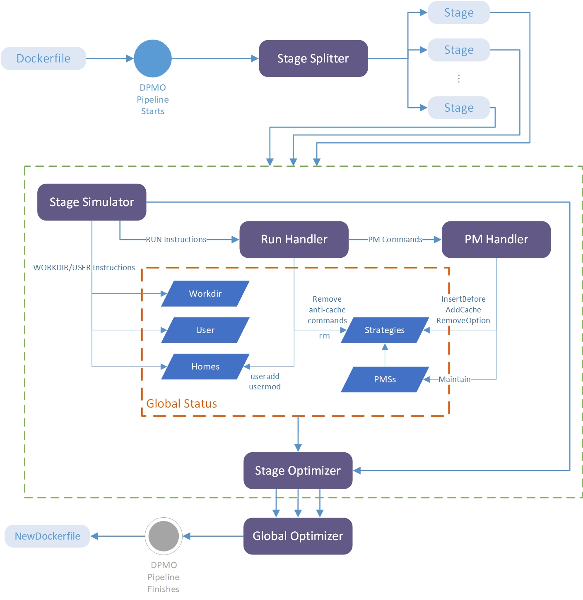

# Dockerfile Package Manager Optimizer
## Introduction

This tool (DPMO) is a dockerfile package manager optimizer. It uses "RUN --mount=type=cache" new BuildKit frontend feature to automatically optimize your Dockerfile with almost no side-effects!

["RUN --mount=type=cache" Dockerfile reference | Docker Documentation](https://docs.docker.com/engine/reference/builder/#run---mounttypecache)

[BuildKit Frontend Syntax images | Docker Hub](https://hub.docker.com/r/docker/dockerfile)


We have evaluated DPMO. For those Dockerfiles that use package managers, DPMO has an **83.20% optimization rate** (10488/12606). Dockerfiles optimized by DPMO have a 99.55% (221/222) successful build rate (the situations that DPMO may fail is illustrated later). Optimized Dockerfiles will manage package managers better. Images built from new Dockerfiles are reduced in size by an average of 12.48MB, network data traffic is reduced by an average of 24.25MB.


The situations in which DPMO may not work or may fail (**We only encountered situation 5 in practice**):

1. BuildKit is disabled in your environment
2. A non-official frontend dockerfile syntax is used in your Dockerfile
3. Except download/install package manager commands (such as `go get`, `apt install`), cache of package managers is needed in build process
4. Cache of package manager (generated from building process) is needed when future container is running
5. Cache directories of package managers must have non-root privileges


### Usage
```shell
Usage: python src/main.py [OPTIONS] [INPUT]
If INPUT is a directory, all files (including subdirectories) in it will be optimized.
A logging file named 'DPMO.log' will be generated.

Options:
  -h            Display this help message and exit
  -o OUTPUT     Optimized output dockerfile path, default to INPUT + SUFFIX
                (SUFFIX is ".optimized" by default, so this will be "INPUT.optimized" by default)
                If INPUT is a directory, then OUTPUT should be a directory too
  -s SUFFIX     Set the prefix of the output file, default to ".optimized"
                If INPUT and OUTPUT both are directories, then SUFFIX will be ignored
  -S            Show optimization statistics for each file
  -f FAIL_FILE  Output all dockerfiles that are failed to optimize into FAIL_FILE
                FAIL_FILE is './DPMO_failures.txt' by default
  -w            Only show warning and error messages in the console
  -n            If specified, DPMO will remove the commands to remove (and the connector after
                it if the connector exists) when optimizing. By default they will be substituted
                with 'true'.
```


#### Simplest usage:

```shell
python src/main.py Dockerfile	# Generate Dockerfile.optimized
```


#### Examples:

```shell
python src/main.py -h

# File INPUT
python src/main.py Dockerfile	# Generate Dockerfile.optimized
python src/main.py -o Dockerfile1 Dockerfile	# Generate Dockerfile1
python src/main.py -o output_dir Dockerfile	# If output_dir is an existed directory, generate output_dir/Dockerfile

# Directory INPUT
python src/main.py -o ./new_dockerfiles ./dockerfiles/	# ./new_dockerfiles/ has the same structure with ./dockerfiles/

# -s SUFFIX
python src/main.py -s .new Dockerfile	# Generate Dockerfile.new
python src/main.py -s .new ./dockerfiles/	# Each file will be added this suffix; for ./dockerfiles/Dockerfile, this will generate ./dockerfiles/Dockerfile.new


# Real examples
python src/main.py -o dockerfiles_output dockerfiles
```


### What can it achieve?

* **Smaller size of the image**. The cache directories of package managers (both third-party and OS package managers) will not exist in the image layers. This means that the size of the image may be reduced.
* **Build Dockerfiles faster**. When rebuilding a Dockerfile (suppose the build cache is invalidated), or when building multiple Dockerfiles, the building process will be significantly accelerated.

Note that only dockerfiles using package managers can be optimized.


### Currently supported package managers

* Third-party package managers
  * npm
  * pip
  * go
  * maven
* OS package managers
  * apt

All configurations for package managers are defined in `resources/settings.yaml`. All rules that DPMO will execute are from this file. You can add your package managers if you need it.


### Why it can be optimized?

#### BuildKit

Since Docker 18.06, BuildKit has been integreted into docker daemon. BuildKit is a next generation container build tool, by integrating BuildKit, users should see an improvement on performance, storage management, feature functionality, and security. Since Docker 20.10, BuildKit is stable, which means it's safe to use in production.

Dockerfile is a frontend language. BuildKit brings some new Dockerfile frontend features which can be enabled by syntax directive in the Dockerfile ([docker/dockerfile - Docker Image | Docker Hub](https://hub.docker.com/r/docker/dockerfile)). A set of Dockerfile frontend syntax rules actually corresponds to an image.

#### RUN --mount=type=cache

Since `docker/dockerfile:1.2`, `RUN --mount=type=cache` is added. With this flag, the specified target directory will be mounted into global docker build cache, and unmounted when finished executing this RUN instruction. When using package managers, cache directories are always ignored or handled incorrectly, which may cause the cache files to remain in the image layers. Furthermore, these cache files cannot be reused across multiple build processes, this may lead to unnecessary duplicate downloads from package manager markets. `RUN --mount=type=cache` can be very helpful for mitigating the problem.


### How does it work?

The workflow is depicted in the figure:


